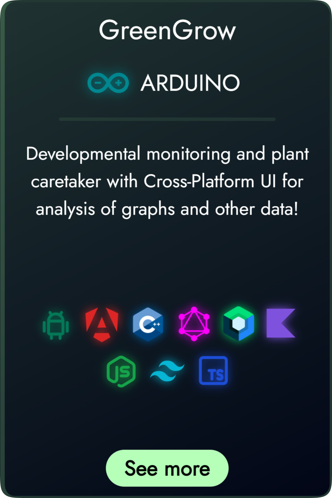

# [GreenGrow](https://greengrow.netlify.app)

<p align="center">
  <a href="https://greengrow.netlify.app" target="_blank"></a>
</p>

## SmartPlant

***Objetivo inicial do projeto criar uma planta inteligente, que possa ser capaz de se alto manter e que tambem possa ser monitorada pelo smartphone.***

> Here we are using a Arduino because some of components needs to use 5v but, if you have a 3.3v to 5v conversor you can use only the esp32

<p align="center">
  <a href="https://greengrow.netlify.app" target="_blank"></a>
</p>

## Tech stack

- [] Arduino
- [X] Esp32
- [] Android
- [X] Web

### Docs

#### Arduino

> Cloud
>
>- [Cloud](https://docs.arduino.cc/arduino-cloud/guides/esp32/)

#### Esp32

Dowload board on IDE

***esp32 by espressif systems***

Arduino IDE board url for ESP 32

``` url
https://espressif.github.io/arduino-esp32/package_esp32_index.json
```

>References
>
>- [Simulator](https://wokwi.com/esp32)
>- [Pinout](https://www.circuitstate.com/pinouts/doit-esp32-devkit-v1-wifi-development-board-pinout-diagram-and-reference/)

### Libs to create WebSocketServe

***Download zip and import following this steps: Arduino IDE -> Sketch -> Include lib -> Add .ZIP***

>Directly links
>
>- [ESPAsyncWebServer](https://github.com/me-no-dev/ESPAsyncWebServer/archive/master.zip)
>- [AsyncTCP](https://github.com/me-no-dev/AsyncTCP/archive/master.zip)

#### Repos and Docs

>Github
>
>- [ESPAsyncWebServer](https://github.com/me-no-dev/ESPAsyncWebServer/)
>- [AsyncTCP](https://github.com/me-no-dev/AsyncTCP/)

``` cpp
#include <ESPAsyncWebServer.h>
#include <AsyncWebSocket.h>
```
